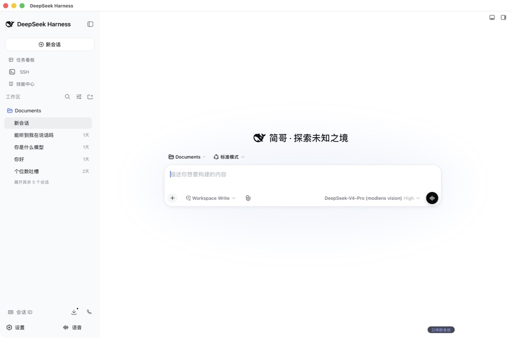
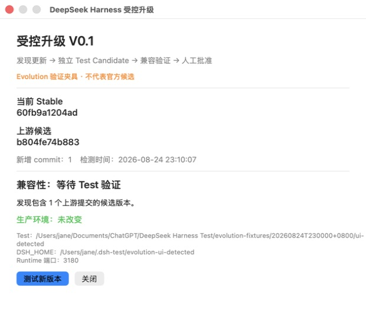
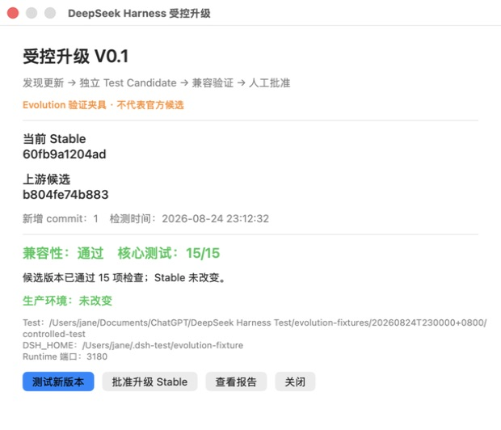

# Controlled updates V0.1

English | [中文](controlled-updates-v0.1.zh.md)

Version: V0.1 · Date: 2026-08-24

## Before

The macOS shell exposed one small update control. When a newer official `master` was detected, clicking the control stopped the production Runtime, rebased the production checkout, ran a frozen install and full build in place, then restarted production. A conflict or failed build therefore occurred inside the only working source and artifact directory.

## After

Detection now records the Stable SHA, candidate SHA, added commit count, and detection time without fetching into the production checkout. **Test new version** opens a focused panel whose write targets are an independent Test root and candidate-specific `DSH_HOME`.

A passed candidate displays the compatibility result, passed-check count, production isolation statement, report action, and approval gate. The screenshots use a visibly labelled Evolution fixture because official `master` still equalled the Stable V0 upstream base on 2026-08-24; the fixture is one empty commit over that exact base and ran the complete candidate pipeline.

## Added capability

- Test-only upstream mirror, versioned physical candidate directories, and candidate states `detected`, `testing`, `passed`, `failed`, and `approved`.
- Stable V0 source and Profile snapshot verification before replaying the ten customization commits.
- Frozen dependency installation, full Runtime/Web build, focused Workspace/Session/Skill/Workflow suites, macOS shell typecheck, and live HTTP/RPC/WebSocket/Workspace/Session/Skill checks on port 3180.
- JSON and Markdown candidate reports with build hashes, pinned Profile versions, failures, and recovery-material references.
- Explicit approval confirmation that records approval without promoting or modifying production.

## Resolution

Candidate testing never stops the production Runtime, writes the production repository, uses production `~/.dsh`, or installs Profile updates. The legacy in-place updater exits immediately. A failed candidate remains available for diagnosis and cannot be approved.

## Remaining work

V0.1 intentionally does not implement `promoted`. A later change must create a fresh pre-promotion recovery point, verify the Stable manifest and recovery materials again, apply the approved candidate through a separately reviewed promotion procedure, and prove rollback before any production write is enabled.

The official upstream had no newer commit during this implementation, so the first real official candidate remains untested until one is detected. The labelled Evolution fixture proves the complete mechanism without presenting itself as an upstream release.

## Screenshot paths

- `docs/evolution/controlled-updates-v0.1/images/before.jpeg`
- `docs/evolution/controlled-updates-v0.1/images/after-detected.jpeg`
- `docs/evolution/controlled-updates-v0.1/images/after-passed.jpeg`
